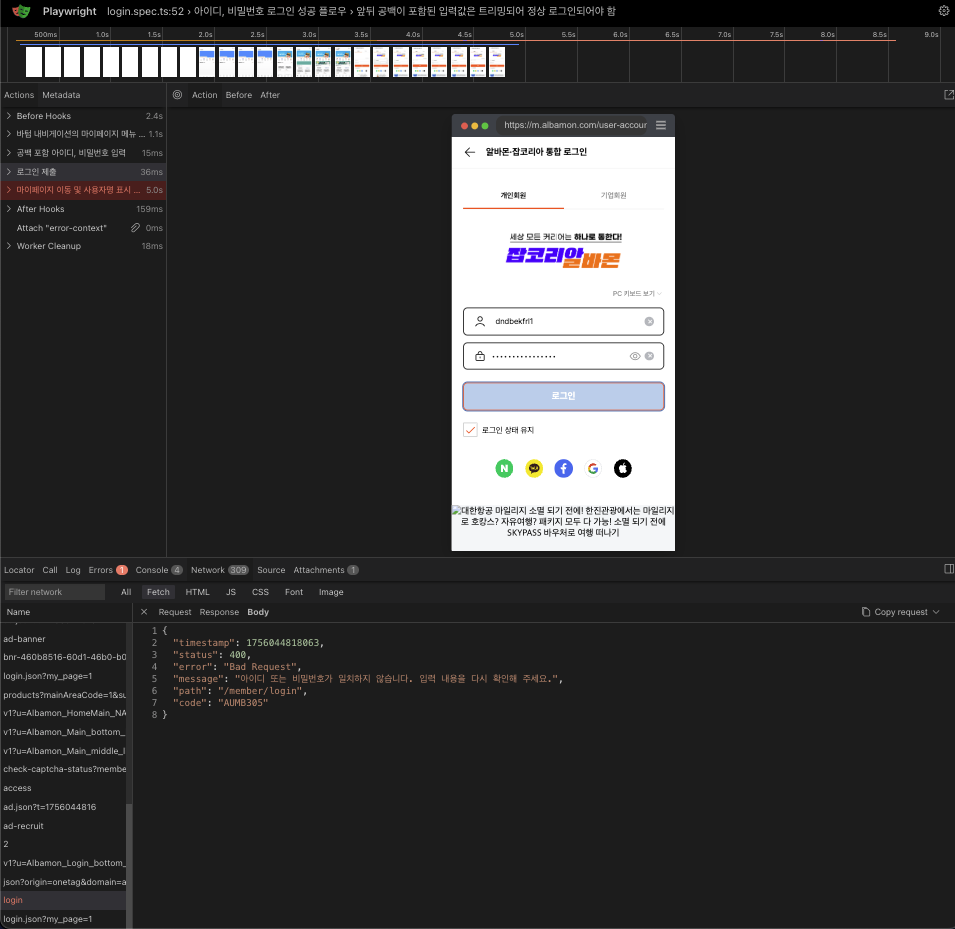

# [AI Challenge] QA

## 프로젝트 개요

[AI Challenge] QA에 참여한 결과물로 AI를 활용해 알바몬 개인 회원 로그인 테스트 케이스 도출, 자동화 스크립트 구현 그리고 테스트 실행 결과를 검토했습니다.

테스트 범위

- 아이디, 비밀번호 입력 로그인
- 로그인 성공 후 마이페이지 이동
- 유효성 검증
- 로그인 실패 시 오류 메시지 확인
- 로그인 세션 만료시 로그인 페이지 이동

## AI 도구 활용 과정

- 사용 도구: ChatGPT-5
- 활용 방법:

  - [테스트 케이스 초안 작성](./테스트코드%20작성%20과정.md)
  - 예외 테스트 케이스 아이디어 도출
  - 테스트 코드 작성
  - [테스트 코드 디버깅](./테스트코드%20디버깅%20과정.md)

- AI 응답 한계:

  - 태스트 코드 작성시 실제 DOM은 반영되지 않고, test id로 선택함
  - 컨텍스트가 주어지지 않는 경우, 일관적이지 않은 응답

- 보완한 내용:

  - 테스트 코드 작성 가이드와 실제 로그인 폼을 첨부하여 올바른 선택자를 선택하도록 함
  - 응답 일관성과 정확성을 높이기 위해 프롬프트를 반복적으로 피드백 받아 개선

## 테스트 케이스 설계

| **구분**  | **설명**                                                                   | **입력값**                           | **실행 조건**                                                                                   | **기대 결과**                                                                                                                 |
| --------- | -------------------------------------------------------------------------- | ------------------------------------ | ----------------------------------------------------------------------------------------------- | ----------------------------------------------------------------------------------------------------------------------------- |
| 성공      | 올바른 아이디/비밀번호 입력 후 로그인                                      | id: user01, pw: Pass123!             | 로그인 페이지 진입 → #idInput, #pwInput 입력 → #loginBtn 터치                                   | URL이 `/personal/mypage`로 변경, 마이페이지에는 사용자 이름이 표시                                                            |
| 성공      | 앞뒤 공백 자동 트리밍 후 로그인                                            | id: "  user01  ", pw: "  Pass123!  " | 값 입력 시 앞뒤 공백 포함 → #loginBtn 탭                                                        | **UI:** 공백 트리밍 처리되어 인증 성공, /mypage 이동,                                                                         |
| 성공      | 미인증 상태에서 마이페이지로 접근 후 로그인 페이지로 복귀(리다이렉트 복귀) | id: user01, pw: Pass123!             | 미인증 상태에서 /mypage 직접 접근 → 로그인 페이지로 리다이렉트 → 자격 증명 입력 후 #loginBtn 탭 | 로그인 성공 즉시 /mypage로 복귀                                                                                               |
| 성공      | 엔터(완료 키) 제출                                                         | id: user01, pw: Pass123!             | #pwInput 포커스 상태에서 모바일 키보드 “완료/Enter” 입력                                        | URL이 `/personal/mypage`로 변경, 마이페이지에는 사용자 이름이 표시                                                            |
| 실패      | 존재하지 않는 계정으로 로그인 시도                                         | id: no_user, pw: Any123!             | #loginBtn 터치                                                                                  | **alert("아이디 또는 비밀번호가 올바르지 않습니다.")** 표시, 확인 시 페이지/URL 유지, #idInput 포커스                         |
| 실패      | 비밀번호 불일치                                                            | id: user01, pw: Wrong999             | 입력 후 #loginBtn 터치                                                                          | **브라우저 alert 동일 문구** 표시, 확인 시 #pwInput만 초기화, #loginBtn 재활성화                                              |
| 실패      | 아이디 공란                                                                | id: "", pw: Pass123!                 | #loginBtn 터치                                                                                  | **UI:** **브라우저 alert("아이디를 입력해주세요")**, 확인 시 #idInput 포커스, 네트워크 요청 미발생                            |
| 실패      | 비밀번호 공란                                                              | id: user01, pw: ""                   | #loginBtn 터치                                                                                  | **UI:** **브라우저 alert("비밀번호를 입력해주세요")**, 확인 시 #pwInput 포커스, 네트워크 요청 미발생                          |
| 세션 만료 | 세션 만료 처리(로그인 후 일정 시간 경과)                                   |                                      | 정상 로그인 완료 후 세션 TTL 초과 → /personal/mypage 재접근                                     | **UI:** **로그인 페이지로 리다이렉트** 또는 **브라우저 alert("세션이 만료되었습니다. 다시 로그인해주세요")**, #idInput 포커스 |

## 자동화 스크립트 구현

- 프레임워크: Playwright(TypeScript)
- 브라우저: Chromium, Mobile Chrome
- 주요 시나리오:
  - 로그인, 비밀번호 입력 후 로그인 성공 시 마이페이지로 이동
  - 로그인 또는 비밀번호 공란시 로그인 실패 메시지 검증
  - 로그인 세션 만료시 로그인 페이지 이동
- 코드 주요 특징:
  - 테스트를 실행하기 전 `beforeEach`단계에서 로그아웃한 상태에서 시작
  - `getByPlaceholder` 접근자 선택자 위주로 사용하여 유지보수성을 고려
  - test.step 활용해 시나리오를 단계별로 기록
- 사용 프롬프트 링크:
  - [Playwright 테스트 작성 가이드.md](./Playwright%20테스트%20작성%20가이드.md)

## 실행 결과

## 결과 검토 및 보완


- 테스트 18개 중 16개가 성공
- 소요된 시간: 48.3s

### 실패 케이스: 입력값 트리밍 미처리



- 우선순위: P3 (기능 전체 장애는 아니지만, 사용자 경험에 직접 영향 있음)
- 테스트 케이스: “앞뒤 공백이 포함된 아이디/비밀번호 입력 시 정상 로그인 처리”
- 테스트 데이터: `␣␣␣${CREDENTIALS.id}␣␣␣` / `␣␣␣${CREDENTIALS.pw}␣␣␣`
- 예상 결과: 입력값이 트리밍되어 정상 로그인 성공
- 실제 결과: API 응답 400 → "아이디 또는 비밀번호가 일치하지 않습니다. 입력 내용을 다시 확인해 주세요."
- 영향 분석:
  - 모바일 환경에서 키보드 입력 시 실수로 공백이 포함되는 경우가 잦음
  - 사용자 입장에서는 “정확한 계정을 입력했는데 로그인 실패”로 혼란 발생
- 조치 방법 제안:
  1. 프론트엔드: 로그인 요청 전 input.trim() 처리
  2. 백엔드: API 단에서도 동일한 트리밍 로직 적용해 이중 방어
  3. 조치 후 리그레션 테스트 진행

## 향후 개선

### CI/CD 도입 (Github Actions)

main 브랜치로 pull request 트리거를 설정해 스모크 테스트로 사용

## 프로젝트 실행 방법

```bash
npm install
npx playwright test
```

```bash
# .env.example
TEST_USER_ID=
TEST_USER_PASSWORD=
TEST_USER_NAME=
```
